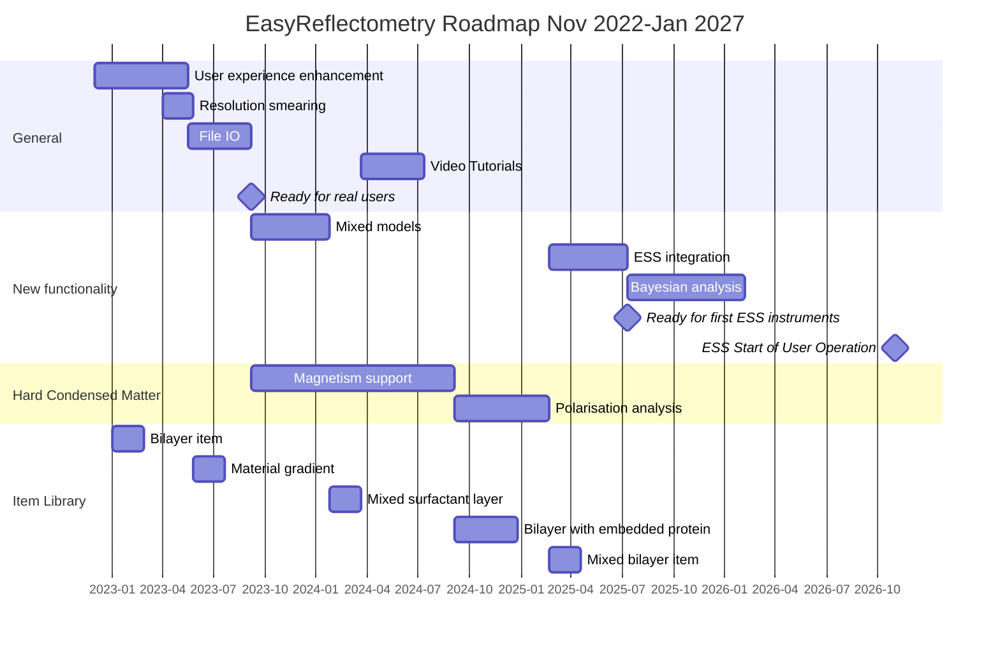

# Roadmap for EasyReflectometry

This documents the planned roadmap for the EasyReflectometry project (containing both [EasyReflectometryApp]() and [EasyReflectometryLib]()) between now and the start of 2027. 
Certain tasks may depend on other Easy-family projects (in particular EasyCore) which will be be noted, where relevant. 

Above we include a Gannt chart showing the roadmap. 
Each epic in this chart can be correlated with a heading below which details it. 
In time, each epic will be populated with a series of issues relating to the part of the Easy-family of projects that it pertains to.
Issues that are general to EasyReflectometry (i.e. those related to interaction with the userbase) will be defined as EasyReflectometryApp issues.  

## Epics details 

### User experience enhancement

The aim of this epic is to improve the user experience in EasyReflectometry. 
Currently, there are a performance issues and user-unfriendly interfaces that should be improved. 
This has the additional benefit of reducing technical debt. 
This includes work such as improving visualisation and adding code signing. 

<!-- #### EasyReflectometryApp issues

- Transition to model `dicttoxml` functionality from EasyCore
- Project pane visualisation
- Summary pane visualisation
- App signing for all platforms
- Example projects
- Improvements to constraint setting UI
- Visualisation of multiple contrasts simultaneously  -->

### Resolution smearing

Currently, we only support a constant Gaussian $q$-resolution function. 
However, many reflectometry analysis libraries support $q$-dependent Gaussian resolution and even arbitrary function resolutions. 

### FileIO

This epic will enable greater interoperability with other analysis packages and plotting software. 
This includes adding functionality for a ORSO model definition file (to be defined) and the ability to output easily data from EasyReflectometry for plotting in other packages

<!-- - Saving model as a data file
- Saving plots/data with greater user control. This could be done with adding new columns to the .ort file for model reflectometry. -->

### Video tutorials

Short video tutorials to accompany example projects.
These can be hosted on YouTube or similar and linked to from easyreflectometry.org.

### Mixed models

`refnx` has the functionality to produce an [incoherent sum of two different models](https://refnx.readthedocs.io/en/stable/refnx.reflect.html#refnx.reflect.MixedReflectModel). 
This is important in accounting for non-uniform films/surfaces. 

### ESS integration

This means integration with the SciCat data catalogue, such that ESS data can be easily loaded to EasyReflectometry. 
Additionally, it will include the use of `scipp` as a data storage object and `plopp` plotting functionality. 

### Bayesian analysis 

Bayesian sampling methods are becoming a more and more important tool in reflectometry analysis. 
While it may be possible to enable this by outputting models built in EasyReflectometry to `refl1d` or `refnx` Python environments, it would be cleaner to have the functionality available in EasyReflectometry. 
This would involve significant EasyCore work, in addition to the development of an EasyApp pane for sampling visualisaton (also beneficial to a potential EasyQens). 

### Magnetism support 

This will begin with enabling the magnetism functionality available in `refl1d`, concurrent to which the graphical user interface will be designed with input from the relevant user communities. 

### Polarisation analysis 

Enabling the analysis of difference between different spin flipper state

### Bilayer item

Introduces a phospholipid bilayer item to the item library. 

### Material gradient

Introduces a material that describes a gradient (with a couple of different function forms) of one material present in another. 

### Mixed surfactant layer

Using the [mixed model](#mixed-models) functionality, making it possible to define more than one surfactant in a layer. 

### Bilayer with embedded protein

A bilayer item but with some concentration of protein embedded in the layer. 
Initially the protein describe would be basic (linking potentially to the protein-SLD calculator) but in future this could be expanded to include the protein-SLD calculator functionality or data from crystallographic or simulation results. 

### Mixed bilayer item 

Using the [mixed model](#mixed-models) functionality, making it possible to define more than one phospholipid type in a bilayer.  