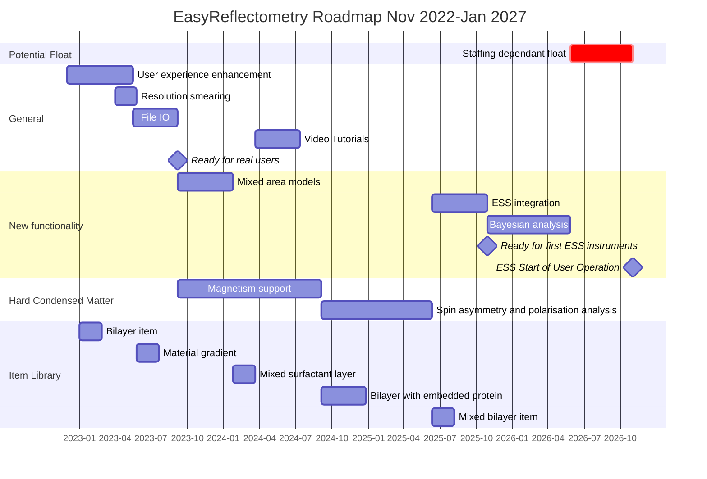

# Roadmap for EasyReflectometry

This documents the planned roadmap for the EasyReflectometry project (containing both [EasyReflectometryApp](https://github.com/easyScience/EasyReflectometryApp) and [EasyReflectometryLib](https://github.com/easyScience/EasyReflectometryLib)) between now and the start of 2027. 
Certain tasks may depend on other Easy-family projects (in particular EasyCore) which will be be noted, where relevant. 

Above we include a Gannt chart showing the roadmap. 
Each epic in this chart can be correlated with a heading below which details it. 
In time, each epic will be populated with a series of issues relating to the part of the Easy-family of projects that it pertains to.
Issues that are general to EasyReflectometry (i.e. those related to interaction with the userbase) will be defined as EasyReflectometryApp issues.  

## Epics details 

### User experience enhancement

The aim of this epic is to improve the user experience in EasyReflectometry. 
Currently, there are a performance issues and user-unfriendly interfaces that should be improved. 
This has the additional benefit of reducing technical debt. 
This includes work such as improving visualisations and adding code signing. 

- [Improve the project information page](https://github.com/easyScience/EasyReflectometryApp/issues/103)
- [Slow UI changes](https://github.com/easyScience/EasyReflectometryApp/issues/102)
- [Improve constraint UI for multiple contrasts](https://github.com/easyScience/EasyReflectometryApp/issues/101)
- [Plotting multiple datasets and models](https://github.com/easyScience/EasyReflectometryApp/issues/85)
- [Scale and background lines break rq^4 plotting](https://github.com/easyScience/EasyReflectometryApp/issues/108)
- [Code signing for all envs](https://github.com/easyScience/EasyReflectometryApp/issues/80)
- [Add examples](https://github.com/easyScience/EasyReflectometryApp/issues/77)
- [Can't run installer version on linux - glibc mismatch?](https://github.com/easyScience/EasyReflectometryApp/issues/38)
- [Fitter options](https://github.com/easyScience/EasyReflectometryApp/issues/32)
- [Model description in the summary page](https://github.com/easyScience/EasyReflectometryApp/issues/28)
- [Clearing the workspace doesn't reset the model name](https://github.com/easyScience/EasyReflectometryApp/issues/124)

### Resolution smearing

Currently, we only support a constant Gaussian $q$-resolution function. 
However, many reflectometry analysis libraries support $q$-dependent Gaussian resolution and even arbitrary function resolutions. 

- [Not currently using resolution column](https://github.com/easyScience/EasyReflectometryLib/issues/4)
- [Enable arbirary functional resolution](https://github.com/easyScience/EasyReflectometryLib/issues/47)

### File IO

This epic will enable greater interoperability with other analysis packages and plotting software. 
This includes adding functionality for a ORSO model definition file (to be defined) and the ability to output easily data from EasyReflectometry for plotting in other packages

- [Output to file that can be plotted ](https://github.com/easyScience/EasyReflectometryApp/issues/82)
- [Enable output of the model in some version of the ORSO model definition file](https://github.com/easyScience/EasyReflectometryLib/issues/11)

### Video tutorials

Short video tutorials to accompany example projects.
These can be hosted on YouTube or similar and linked to from easyreflectometry.org.

- [Create video tutorials to match the examples]()

### Mixed area models

`refnx` has the functionality to produce an [incoherent sum of two different models](https://refnx.readthedocs.io/en/stable/refnx.reflect.html#refnx.reflect.MixedReflectModel). 
This is important in accounting for non-uniform films/surfaces. 

- [Mixed area models capability](https://github.com/easyScience/EasyReflectometryApp/issues/105)

### ESS integration

This means integration with the SciCat data catalogue, such that ESS data can be easily loaded to EasyReflectometry. 
Additionally, it will include the use of `scipp` as a data storage object and `plopp` plotting functionality. 

- [Intraction with SciCat data catalogue](https://github.com/easyScience/EasyReflectometryLib/issues/48)
- [SciCat GUI integration in Experiment pane](https://github.com/easyScience/EasyReflectometryApp/issues/110)
- [Integrate orsopy metadata into scipp object](https://github.com/easyScience/EasyReflectometryLib/issues/49)
- [Use scipp for data storage in the application](https://github.com/easyScience/EasyReflectometryApp/issues/111)
- [Use plopp as a plotting engine in a Jupyter Notebook](https://github.com/easyScience/EasyReflectometryLib/issues/50)
- [Use plopp as a plotting engine in the application](https://github.com/easyScience/EasyReflectometryApp/issues/112)

### Bayesian analysis 

Bayesian sampling methods are becoming a more and more important tool in reflectometry analysis. 
While it may be possible to enable this by outputting models built in EasyReflectometry to `refl1d` or `refnx` Python environments, it would be cleaner to have the functionality available in EasyReflectometry. 
This would involve significant EasyCore work, in addition to the development of an EasyApp pane for sampling visualisaton (also beneficial to a potential EasyQens). 

- [Develop "Sampling" tab for control and visualisation of sampling results](https://github.com/easyScience/EasyReflectometryApp/issues/57)
- [Advanced fitter view](https://github.com/easyScience/EasyReflectometryApp/issues/30)
- [Enable non-uniform priors in fitting](https://github.com/easyScience/EasyReflectometryLib/issues/12)
- [Enable the usage of EasyCore Bayesian methods](https://github.com/easyScience/EasyReflectometryLib/issues/52)

### Magnetism support 

This will begin with enabling the magnetism functionality available in `refl1d`, concurrent to which the graphical user interface will be designed with input from the relevant user communities. 

- [Discuss with user community and document requirements for magnetism](https://github.com/easyScience/EasyReflectometryApp/issues/113)
- [Expose magnetisation in EasyReflectometryLib](https://github.com/easyScience/EasyReflectometryLib/issues/21)
- [Develop GUI for magnetism support](https://github.com/easyScience/EasyReflectometryApp/issues/114)
- [Create compatibility functions between magnetisation in calculators](https://github.com/easyScience/EasyReflectometryLib/issues/17)

### Spin asymmetry and polarisation analysis 

Enabling the analysis of difference between different spin flipper state

- [Discuss with user community and document requirements for polarisation analysis](https://github.com/easyScience/EasyReflectometryApp/issues/115)
- [Discuss with user community and document requirements for spin asymmetry](https://github.com/easyScience/EasyReflectometryApp/issues/119)
- [Expose polarised neutron beams in python package](https://github.com/easyScience/EasyReflectometryLib/issues/51)
- [Develop GUI to enable polarisation analysis](https://github.com/easyScience/EasyReflectometryApp/issues/116)
- [Develop GUI to enable spin asymmetry](https://github.com/easyScience/EasyReflectometryApp/issues/118)

### Item library

Here we collect all the issues related to the item library objects. 
Note that more items can be developed based on user requirements. 

Phospholipid bilayer. 

- [Add a bilayer item type](https://github.com/easyScience/EasyReflectometryLib/issues/38)
- [Develop GUI object for bilayer item type](https://github.com/easyScience/EasyReflectometryApp/issues/117)

Material layer that describes a gradient (with a couple of different function forms) of one material present in another.

- [Add a material gradient item type](https://github.com/easyScience/EasyReflectometryLib/issues/53)
- [Develop GUI object for material gradient type](https://github.com/easyScience/EasyReflectometryApp/issues/120)

Using the [mixed models](#mixed-area-models) functionality, making it possible to define more than one surfactant in a layer. 

- [Add a mixed surfactant item type](https://github.com/easyScience/EasyReflectometryLib/issues/54)
- [Develop GUI object for mixed surfactant item type](https://github.com/easyScience/EasyReflectometryApp/issues/121)

A bilayer item but with some concentration of protein embedded in the layer. 
Initially the protein describe would be basic (linking potentially to the protein-SLD calculator) but in future this could be expanded to include the protein-SLD calculator functionality or data from crystallographic or simulation results. 

- [Add a bilayer with protein embedded item type](https://github.com/easyScience/EasyReflectometryLib/issues/55)
- [Develop GUI object for bilayer with protein embedded type](https://github.com/easyScience/EasyReflectometryApp/issues/122)

Using the [mixed area models](#mixed-area-models) functionality, making it possible to define more than one phospholipid type in a bilayer.  

- [Add a mixed bilayer item type](https://github.com/easyScience/EasyReflectometryLib/issues/56)
- [Develop GUI object for mixed bilayer type](https://github.com/easyScience/EasyReflectometryApp/issues/123)